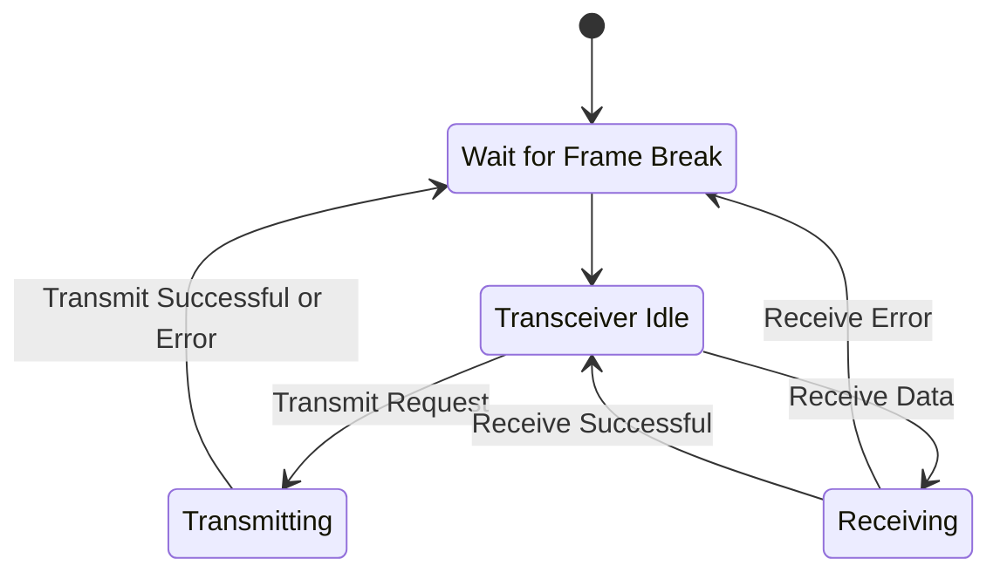

# Tinbus
The main characteristic of tinbus are:
1. Operates at 10 kbps
1. Supports up to 16 nodes
1. Does not require a master node 
1. Can provide power and data on a single pair of wires
1. Does not require an accurate time reference (+/-10%)
1. Can provide galvanic isolation with minimal cost and complexity
1. Short message frames of less than 254 bytes
1. Compatible with any physical line drivers that provide a logical OR of the dominant line signal (LINBUS, CANBUS, SAE J1708, Open collector)

## Line Encoding
Tinbus uses a run length limited 4B-5B encoding scheme similar to group coded recording (GCR).  The basic timing characteristics of a single nibble followed by a frame break are illustrated below.

The encoding only uses the leading edge of the dominant pulse for data recovery. Consequently, some analogue low pass filtering of the electrical signal can significantly improve noise immunity. This makes the encoding insensitive to any asymetry in the rise and fall time and propogation of the signal.

### Byte Encoding
Each byte of data is transmitted as a pair of 4 bit nibbles. A frame with an odd number of nibbles is discarded as invalid.

### Run Length Limit
A maximum of two missing dominant pulses will be allowed in any valid data frame. This ensures reliable clock recovery when devices have innacurate frequency references. Four or more missing dominant pulses are used to signal a frame break.

### Tranceiver State Diagram

## Data Encoding
CBORM is used to serialise data in a compact format. It is based on principles borrowed from CBOR. The encoding is simplifeid to a flat data structure with 3 basic message types:
1. Signed 32 bit integers
2. Base64 (6 bit unsigned values) 
3. Byte arrays or strings (up to 64 bytes long)
