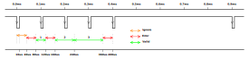

# Tinbus
The main characteristic of tinbus are:
1. Operates at 10 kbps
1. Supports up to 16 nodes
1. Does not require a master node 
1. Provides power and data on a single pair of wires
1. Does not require an accurate time reference (+/- 10%)
1. Can provide galvanic isolation with minimal cost

## Line Encoding
Tinbus uses a run length limited 4B-5B encoding scheme similar to modified group coded recording (GCR). The timing characteristics are illustrated below.

## Tinned
Tinned is used to serialise messages in a compact format, it is based on principles borrowed from CBOR.
### Integer
A 32 bit value that is encode using a minimal number of bytes.
### Byte Array
An array of upto 64 bytes.
### Base64
A single 6 bit value.

### Packet Framing

Tinned packets can be framed by either 
1. time based breaks in a lower level protocol
2. encoding with a method similar to COBS/R

#### Modified COBSR
COBSR requires a byte be appended to the beginning of the buffer. This complicates buffer handling, it would be simpler to add the byte to the end of the buffer. Ideally we want to process buffers in place, without copy.
