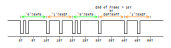

# Tinbus
Tinbus provides...
1. Power and data over two wires (Signal and Ground)
1. Multiple devices on a single bus
1. No need for a bus master or controller
1. Compatibilty with standard UART encoding (8N1)
1. Compatibilty with standard electrical line drivers
1. Easy implementation
1. Galvanic isolation with minimal cost and complexity

Tinbus is not...
1. An efficient protocol for transferring large amounts of data

The protocol is intended to provide a simple method to connect several devices on a bus.

## Physical Layer
Tinbus may be used with any physical layer that provides a logical OR of the dominant signal sent by devices on the bus. Examples of compatible physical layers are:

1. Tinbus (power and data over 2 wires)
1. Open collector or drain
1. Linbus line driver
1. Canbus line driver
1. SAE J1708 (which uses RS485 line driver)

The physical layer configuration will determine the maximum data rate of the bus. 

The Tinbus physical layer is designed to allow power and data to be provided over 2 wires. This is achieved by providing power for at least 80 % of the time.

The physical layer of Tinbus is designed to be compatible with standard UART signalling and uses 8 data bits, no parity and one stop bit. Each bit in the message is encoded using one UART character, 0xEF (for 1), 0xFD (for 0) and 0xFF (for end of frame). Consequently, the data rate is reduced to 1/10 of the baud rate. The transmission of a zero bit is dominant. If two or more devices are transmitting and send conflicting bits then the result will be 0xED. This will be interpretted by all devices as a '0' and the device that was trying to send the '1' will abort its transmission.

## Data Link Layer

### Framing

1. Uses Media access is CSMA/NDA (Carrier Sense Multiple Access with Non Destructive Arbitration)

## Line Encoding
Tinbus is compatible with standard UART encoding. It only encodes one bit per character to ensure:

1. Power is available to devices on the bus for at least 80 % of the time
1. Non destructive arbitration can be implemented with standard UART hardware.

The basic timing characteristics are illustrated below, where T is the bit period.

Decoding only needs to detect the leading edge of the dominant pulse for data recovery. This makes the decoding less sensitive to asymetry in the rise and fall times and propogation times of the signal. It also allows data to be passed through transformers and AC coupled connections.

### Byte Encoding
Each byte of data is transmitted as 8 characters with the most significant bit being sent first. A valid frame will have a multiple of 8 characters.

### Frame Encoding
Bytes that make up a message are sent as a frame. All the bits in the frame are sent without any break between characters. An idle period of at least 2 characters marks the end of the frame.

## Error Detection
An 8 bit CRC is added to the end of all frames to provide error detection. The polynomial used is 0x97 and has optimal performance for messages up to 14 bytes.

## Data Encoding
CBORM is used to serialise data into a simple and compact format. It is based on principles borrowed from CBOR. The encoding is simplifeid to a flat data structure with 3 basic message types:
1. Signed 32 bit integers
2. Base64 (6 bit unsigned values)
3. Byte arrays or strings (up to 64 bytes long)