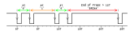
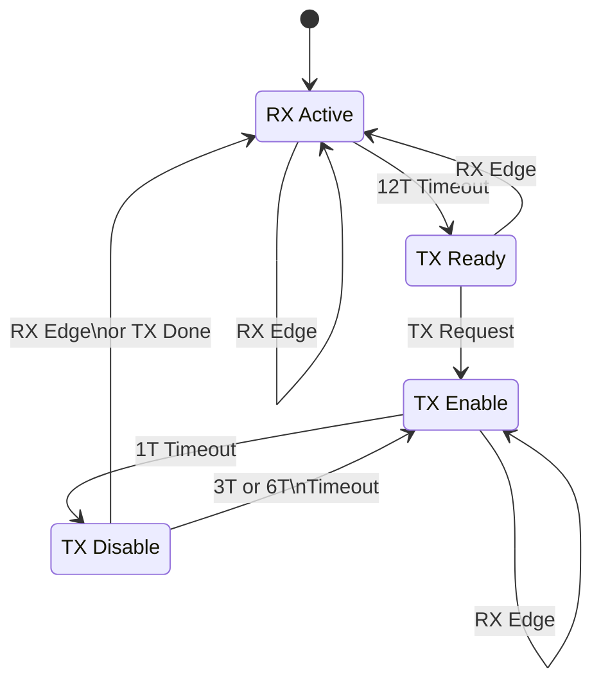

# Tinbus
Tinbus is an acronym for Temporal Impulse Network Bus.

Pulses are are sent at different times to encode bits of data over a shared network bus.

## Tinbus Features
Tinbus provides...
1. Simple electronic hardware and software implementation
1. Agnostic of the underlying system voltage (3V3 or 5V etc)
1. Isolation using very low cost opto couplers (FOD817C etc)
1. Low operating and quiescent power consumption
1. Power and data over only two wires (Signal and Ground)
1. Multiple devices on a single bus using carrier sense multiple access
1. No need for a bus master as it uses collision detection with non-destructive arbitration
1. High tolerance to clock frequency inaccuracy
1. Low overhead data framing mechanism
1. Maximum speed of about 10 Kbps due to the low cost opto couplers
1. Transmission distance of at least 100 m

The protocol is intended to provide a simple method to communicate between several devices on a bus.

## Physical Layer

The Tinbus physical layer is designed to allow power and data to be provided over 2 wires. This is achieved by using a signalling scheme that allows active power for at least 66 % of the time.

### Physical Signalling 

The basic timing characteristics are illustrated below, where T is the pulse period. With low cost opto couplers T cannot be less than about 30 us. The round trip delay of transmitting to the the bus and receiving from the bus needs to be less than the pulse width. Decoding only needs to detect the leading edge of the pulse for data recovery. This makes the decoding less sensitive to asymmetry in the rise and fall times and propagation times of the signal. A slow data rate also allows the protocol to be implemented on a low speed micro controller.

The transmission of a zero bit is dominant in the collision arbitration process. If two or more devices are attempting to transmit and send conflicting bits then the device attempting to send a '1' will abort immediately after receiving the '0' from the other device. All other devices on the bus will only receive the uncorrupted '0'. The successful node will continue transmitting.

The end of a data frame is implied by the absence of data pulses for more than 24 T.

The signal encoding and decoding state diagram is illustrated below.

### Physical Medium Attachment

The bus voltage is nominally 12 V and the supply current is limited to 60 mA maximum. The total average current drawn by devices attached to the bus should be limited to 40 mA.

A dominant signal is sent by pulling the bus voltage down towards zero for about 20 us. The pull down current should be limited to 80 mA maximum and would ideally pull down to below 2 V.

### Medium Dependant Interface
Tinbus does not specify any particular connector. Wiring needs to be selected to ensure loop resistance is less than 15 Ohms.

## Data Link Layer

Tinbus adapts to the data link layer of CAN bus. This provides a standard interface in the OSI stack and allows projects to leverage from Higher Level Protocols and applications developed for CAN bus.

